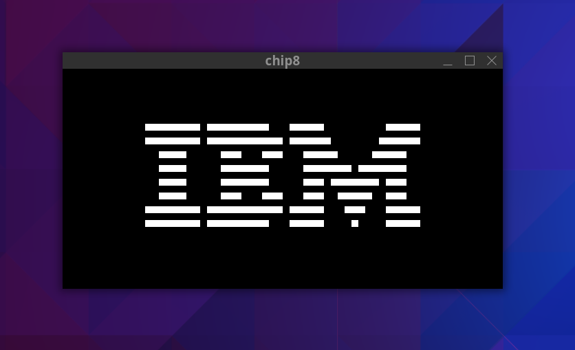

# chip8
A rudimentary implementation of an emulator for the [CHIP-8](https://en.wikipedia.org/wiki/CHIP-8) programming language. The goal of the project was to run the "Hello, World!" of CHIP-8: the IBM Logo ROM.

## Goals
✅ Minimum Viable Project: Run IBM Logo ROM

✅ Use C++ in a project for the first time

✅ Use SDL2 for the first time

✅ Use CMake for the first time

## Installation/Usage
TDB

## Future Improvements
* Code cleanup
* Better memory management
* Improved access control on objects
* Fully implementing all instructions
* Testing more ROMs

## Dependencies
* [CMake](https://cmake.org/)
* [SDL2](https://www.libsdl.org/)
* [GTest](https://github.com/google/googletest)

## References
* [Cowgod's CHIP-8 Technical Reference v1.0](http://devernay.free.fr/hacks/chip8/C8TECH10.HTM)
* [Mastering CHIP-8](https://github.com/mattmikolay/chip-8/wiki/Mastering-CHIP%E2%80%908#chip-8-instructions)
* [Awesome CHIP-8](https://chip-8.github.io/links/#documentation)
